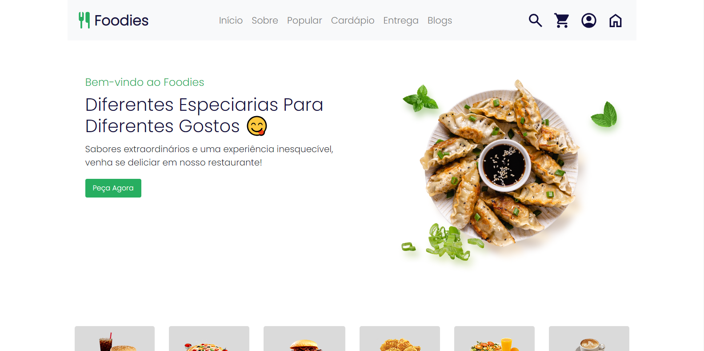

# <h1 align='center'> Foddies </h1>

Você pode acessá-lo com 

#

# sobre

Foddies é uma aplicação web que exibe um restaurante

Você pode acessá-lo com este link.

# tecnologias

Esse projeto foi desenvolvido com as seguintes ferramentas:

HTML5
CSS3
BootStrap
JavaScript

# acesso ao projeto

# 📁 Acesso ao projeto

**Indique como é possível baixar ou acessar o código fonte do projeto, seja projeto inicial ou final**

# 🛠️ Abrir e rodar o projeto

**Apresente as instruções necessárias para abrir e executar o projeto**